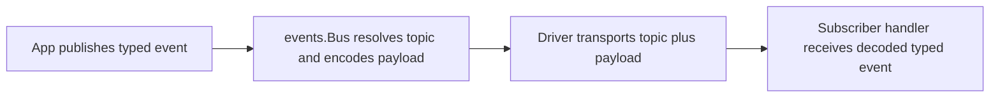
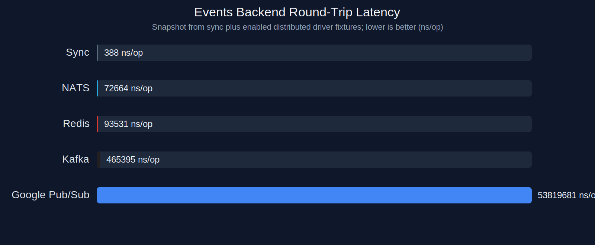
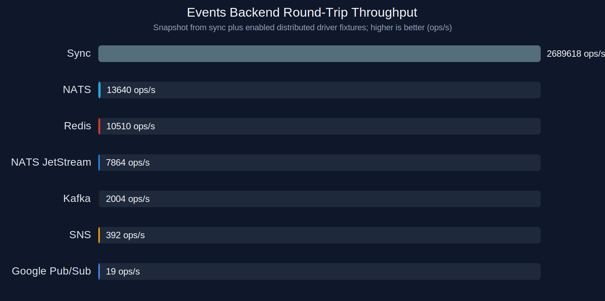
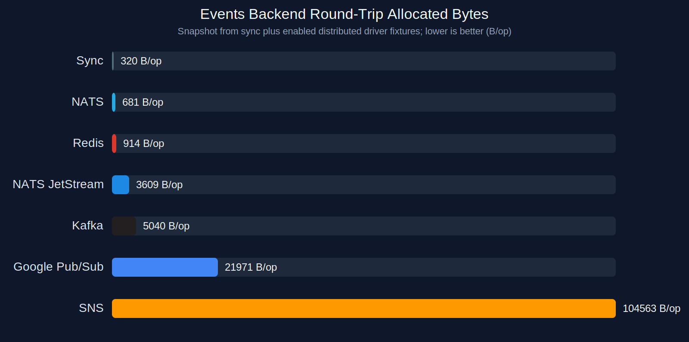
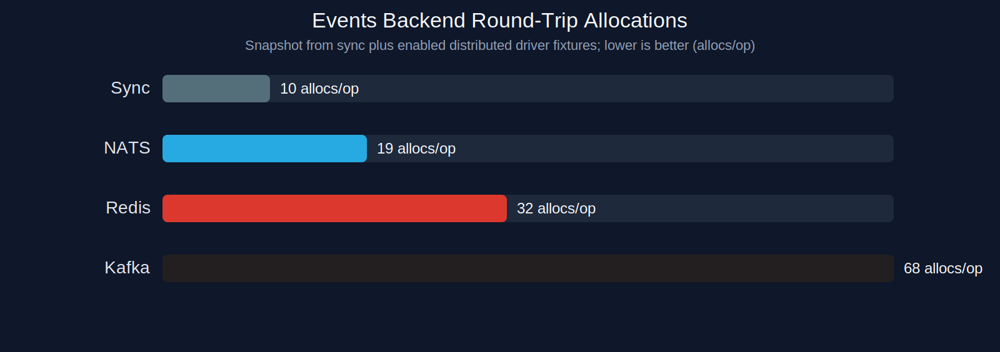

# events

<p align="center">
    events is a typed event bus library for local dispatch and distributed pub/sub.
</p>

<p align="center">
    <a href="https://pkg.go.dev/github.com/goforj/events"></a>
    <a href="LICENSE"></a>
    <a href="https://github.com/goforj/events/actions"></a>
    <a href="https://golang.org"></a>
    
    <a href="https://goreportcard.com/report/github.com/goforj/events"></a>
    <a href="https://codecov.io/gh/goforj/events"></a>
<!-- test-count:embed:start -->
    
    
<!-- test-count:embed:end -->
</p>

## What events is

`events` gives Go applications one typed event API with local and distributed
delivery options.

The public API is type-based:

- publish concrete event values
- subscribe typed handlers
- optionally override transport topics with `Topic() string`

The transport contract is topic-based:

- drivers receive resolved topic names plus encoded payload bytes
- root constructors stay small and dependency-light
- optional backends live in separate driver modules

This library is for event publication and pub/sub fan-out. It is not the queue
or worker-processing library. Durable job semantics such as retries, backlog
draining, dead-lettering, and worker concurrency belong in
[`queue`](https://github.com/goforj/queue).

## Installation

```bash
go get github.com/goforj/events
```

Optional distributed backends are separate modules. Install only what you use:

```bash
go get github.com/goforj/events/driver/natsevents
go get github.com/goforj/events/driver/redisevents
go get github.com/goforj/events/driver/kafkaevents
go get github.com/goforj/events/driver/gcppubsubevents
```

## Quick Start

```go
package main

import (
	"context"
	"fmt"

	"github.com/goforj/events"
)

type UserCreated struct {
	ID string `json:"id"`
}

func main() {
	bus, _ := events.NewSync()
	_, _ = bus.Subscribe(func(ctx context.Context, event UserCreated) error {
		fmt.Println("received", event.ID, ctx != nil)
		return nil
	})
	_ = bus.Publish(UserCreated{ID: "123"})
}
```

## Topic Override

```go
type UserCreated struct {
	ID string `json:"id"`
}

func (UserCreated) Topic() string { return "users.created" }
```

## Drivers

|                                                                                                Driver / Backend | Mode | Fan-out | Durable | Queue Semantics | Notes |
|----------------------------------------------------------------------------------------------------------------:| :--- | :---: | :---: | :---: | :--- |
|       | In-process | ✓ | x | x | Root-backed synchronous dispatch in the caller path. |
|      | Drop-only | x | x | x | Root-backed no-op transport for disabled eventing and tests. |
|         | Distributed pub/sub | ✓ | x | x | Subject-based transport with live integration coverage. |
|       | Distributed pub/sub | ✓ | x | x | Redis pub/sub transport; Streams are intentionally deferred. |
|       | Distributed topic/log | ✓ | Partial | x | Current driver validates topic-based fan-out compatibility, not full consumer-group semantics. |
|  | Distributed topic/subscription | ✓ | Partial | x | Emulator-backed Google Pub/Sub integration with per-subscription fan-out mapping. |
|           | Queue target | Planned | ✓ | ✓ | Deferred until a separate async capability surface is intentionally introduced. |

## Driver Constructor Quick Examples

Use root constructors for local backends, and driver-module constructors for
distributed backends. Driver backends live in separate modules so applications
only import/link the optional dependencies they actually use.

```go
package main

import (
	"context"

	"github.com/goforj/events"
	"github.com/goforj/events/driver/gcppubsubevents"
	"github.com/goforj/events/driver/kafkaevents"
	"github.com/goforj/events/driver/natsevents"
	"github.com/goforj/events/driver/redisevents"
)

func main() {
	ctx := context.Background()

	events.NewSync()
	events.NewNull()

	natsevents.New(natsevents.Config{URL: "nats://127.0.0.1:4222"})
	redisevents.New(redisevents.Config{Addr: "127.0.0.1:6379"})
	kafkaevents.New(kafkaevents.Config{Brokers: []string{"127.0.0.1:9092"}})
	gcppubsubevents.New(ctx, gcppubsubevents.Config{
		ProjectID: "events-project",
		URI:       "127.0.0.1:8085",
	})
}
```

## Module Layout

| Category | Module | Purpose |
| --- | --- | --- |
| Core | `github.com/goforj/events` | Public bus API and root-backed implementations |
| Core | `github.com/goforj/events/eventscore` | Shared driver-facing contracts and driver names |
| Core | `github.com/goforj/events/eventstest` | Shared contract harness for bus implementations |
| Testing | `github.com/goforj/events/eventsfake` | Assertion-oriented fake/testing helpers |
| Driver Modules | `github.com/goforj/events/driver/*events` | Optional distributed transport modules |
| Testing and tooling | `github.com/goforj/events/integration` | Centralized live integration and benchmark harnesses |
| Testing and tooling | `github.com/goforj/events/examples` | Compile-checked example programs |
| Testing and tooling | `github.com/goforj/events/docs` | README/docs/example tooling |

## How It Works



## Delivery Semantics

The root contract is intentionally small and honest:

- `sync` runs handlers inline in the caller goroutine
- distributed drivers publish encoded payloads to a broker/emulator transport
- distributed subscriptions are fan-out oriented
- `Publish` is not a queue/job-processing API

For more detail, see:

- [docs/delivery-semantics.md](docs/delivery-semantics.md)
- [docs/compatibility.md](docs/compatibility.md)

## events vs queue

Use `events` when you want:

- typed event publication
- event subscriptions
- local dispatch
- distributed pub/sub fan-out

Use `queue` when you want:

- background workers
- retries and redelivery
- backlog processing
- dead-letter behavior
- queue administration and job lifecycle control

## Validation

The normal local verification flow is:

- `sh scripts/test-all-modules.sh`
- `sh scripts/check-docs.sh`
- `sh scripts/check-bench-smoke.sh`
- `sh scripts/coverage-codecov.sh`

To run live backend validation as part of the same loop:

- `sh scripts/test-integration.sh`
- `RUN_INTEGRATION=1 sh scripts/coverage-codecov.sh`
- `RUN_INTEGRATION=1 sh scripts/check-bench-smoke.sh`

The integration suite is centralized under `integration/` and exercises the
implemented distributed drivers against live container-backed backends.

The matrix package under `integration/all` supports fixture selection via
`INTEGRATION_DRIVER`, for example `INTEGRATION_DRIVER=nats` or
`INTEGRATION_DRIVER=redis`.

## Benchmarks

Benchmark smoke is intentionally narrow. It tracks the hot in-process paths and,
when enabled, a minimal distributed round-trip benchmark through the
integration harness.

Normal docs iteration should render from the saved benchmark snapshot, not
re-run live backend benchmarks. Use:

```bash
sh scripts/update-docs.sh
```

To refresh the live benchmark snapshot and regenerate the charts:

```bash
sh scripts/refresh-bench-snapshot.sh
```

<!-- bench:embed:start -->
_generated by `go test -tags=benchrender ./docs/bench -run TestRenderBenchmarks`_

Core hot-path benchmarks track the in-process event bus overhead directly.
Backend round-trip benchmarks compare the local sync bus against every enabled broker-backed driver fixture.

### Core Hot Paths

| Benchmark | ns/op | ops/s | B/op | allocs/op |
|:----------|-----:|-----:|-----:|---------:|
| `ResolveTopic` | 157.3 | 6357279 | 96 | 6 |
| `NewRegisteredHandler` | 182.9 | 5467469 | 96 | 6 |
| `PublishNoSubscribers` | 198.9 | 5027652 | 104 | 7 |
| `PublishOneSubscriber` | 364.4 | 2744237 | 336 | 10 |
| `SyncPublishRoundTrip` | 380.1 | 2630887 | 336 | 10 |
| `PublishMultipleSubscribers` | 831.3 | 1202935 | 1000 | 16 |

### Backend Round-Trip by Driver

These charts compare one publish-plus-delivery round trip for `sync` and each enabled distributed driver fixture.

Note: `gcppubsub` is excluded from the default charts because the Pub/Sub emulator is not representative enough for backend latency comparison. Benchmark it explicitly with `INTEGRATION_DRIVER=gcppubsub` when needed.








<!-- bench:embed:end -->

These checks are for obvious regression detection, not for noisy micro-optimism
or hard CI performance gates.

## Docs Tooling

The repository includes lightweight docs tooling under `docs/`:

- `sh scripts/update-docs.sh` is the fast docs loop; it renders benchmark charts from the saved snapshot
- `sh scripts/refresh-bench-snapshot.sh` refreshes the live benchmark snapshot and regenerates the charts
- `go run ./docs/readme` updates generated README sections and validates required structure
- `go run ./docs/readme/testcounts` updates executed test-count badges
- `go run ./docs/examplegen` lists example programs used by docs checks
- `sh docs/watcher.sh` reruns the fast docs update loop locally

## API Index

<!-- api:embed:start -->
_generated by `go run ./docs/readme`_

### Core

| Package | API | Purpose |
| --- | --- | --- |
| `events` | `New`, `NewSync`, `NewNull`, `WithCodec` | Root constructors and options for the typed bus. |
| `events` | `Bus.Publish`, `Bus.PublishContext` | Publish typed events through the configured transport. |
| `events` | `Bus.Subscribe`, `Bus.SubscribeContext` | Register typed handlers and receive a closable subscription. |
| `events` | `Bus.Ready`, `Bus.ReadyContext`, `Bus.Driver`, `Bus.Close` | Transport health, backend identity, and shutdown. |
| `events` | `NewFake` | Lightweight root fake for application tests. |
| `eventscore` | `Driver`, `Message`, `DriverAPI`, `Subscription` | Driver-facing transport contracts. |
| `eventstest` | `RunBusContract`, `RunNullBusContract` | Shared contract harness for bus implementations. |
| `eventsfake` | `New` | Assertion-oriented fake/testing helper module. |

### Driver Modules

| Package | Constructor | Purpose |
| --- | --- | --- |
| `driver/natsevents` | `natsevents.New` | NATS subject-based distributed fan-out transport. |
| `driver/redisevents` | `redisevents.New` | Redis pub/sub distributed fan-out transport. |
| `driver/kafkaevents` | `kafkaevents.New` | Kafka topic-based fan-out compatibility transport. |
| `driver/gcppubsubevents` | `gcppubsubevents.New` | Google Pub/Sub emulator-backed transport. |
<!-- api:embed:end -->

## Release Tagging

This repository uses per-module tags. Use `scripts/tag-all-modules.sh vX.Y.Z` to
apply the root tag plus matching module tags for:

- `eventscore`
- `eventstest`
- `eventsfake`
- `examples`
- `docs`
- `driver/gcppubsubevents`
- `driver/kafkaevents`
- `driver/natsevents`
- `driver/redisevents`
- `integration`
